# Linux基础

## 实验环境
* Virtualbox虚拟机
* Ubuntu 18.04.4 Server 64bit

***
## 实验问题与解答
### 1、如何配置无人值守安装iso并在Virtualbox中完成自动化安装？

* 传输宿主机上下载好的ubuntu的iso镜像至虚拟机用户目录(具体方法见实验问题与解答3)

* 使用mount语句，挂载iso镜像文件到新建的专用目录loopdir

* 使用rsync -av loopdir/ cd语句，克隆光盘内容到新建的工作目录cd

* 使用umount语句卸载iso镜像后，进入工作目录cd,**置顶**添加自动安装菜单选项
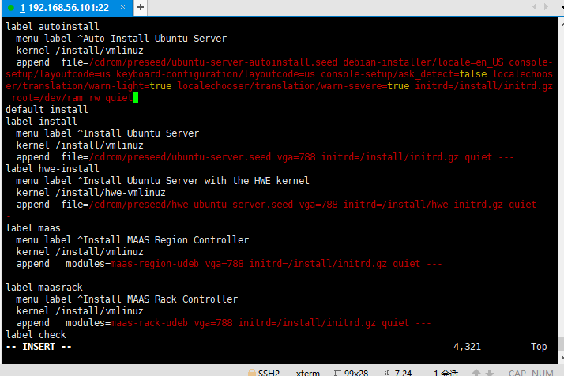
&emsp;

* 修改后输入:wq!语句实现**强制保存**退出

* 将用官方提供的示例编辑制定好的.seed文件保存至~/cd/preseed文件夹下(具体方法见实验问题与解答3)

* 进入isolinux/isolinux.cfg文件，修改timeout 300 为 timeout 10
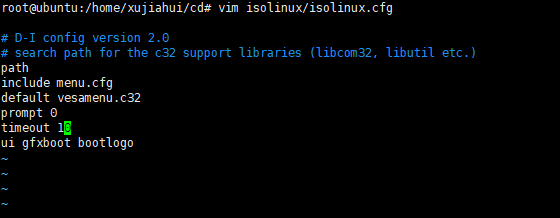

&emsp;
* 重新生成md5sum.txt，封闭改动后的目录到.iso，成功制作了custom.iso镜像
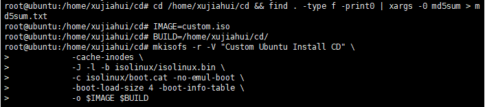
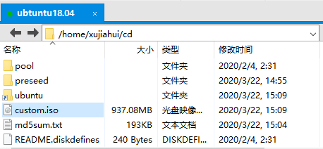

&emsp;
* 将custom.iso传输至主机，并在虚拟机中挂载，OK
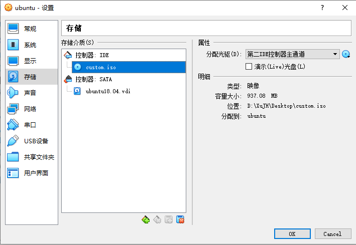

&emsp;
* 启动对应的虚拟机，即可开始自动安装
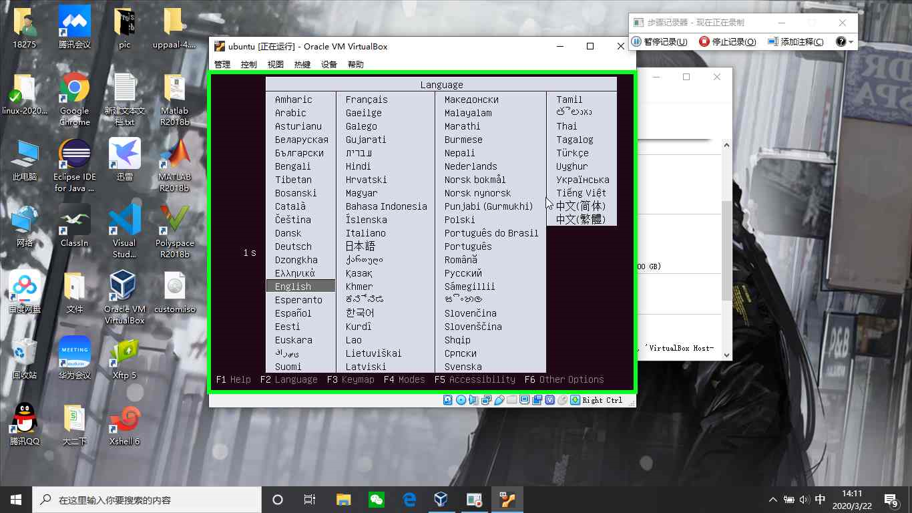
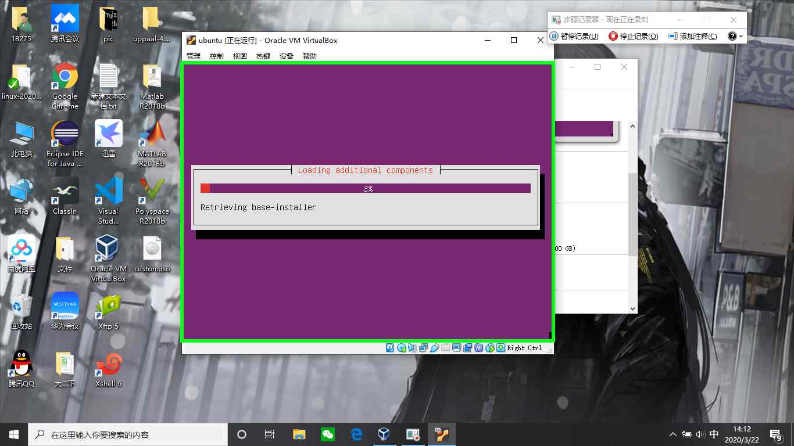

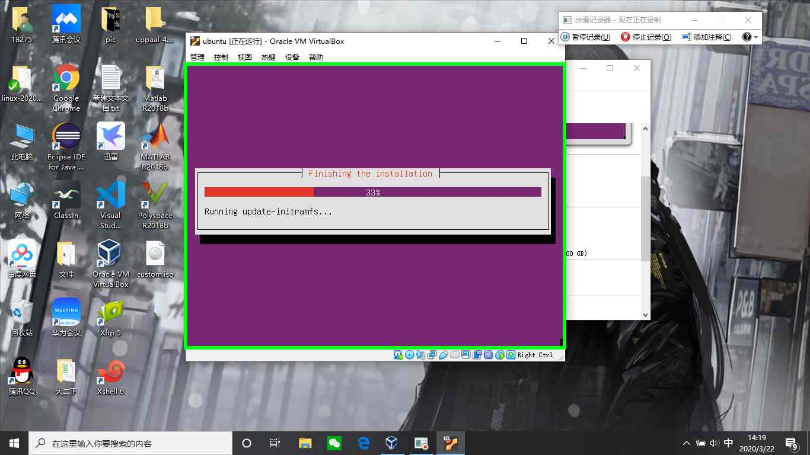
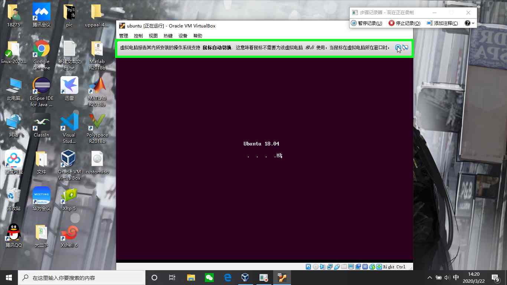

&emsp;
* 安装结束，输入设置的用户名和密码，成功登录
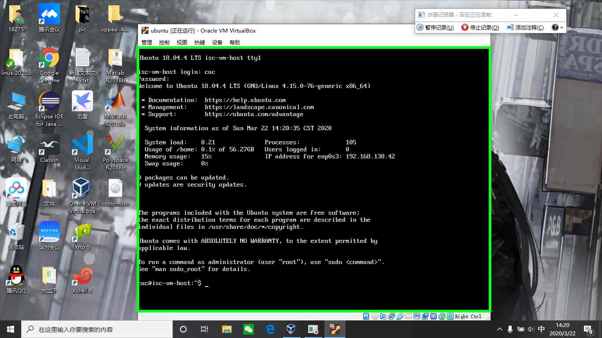

&emsp;
### 2、Virtualbox安装完Ubuntu之后新添加的网卡实现系统如何实现开机自动启用和自动获取IP？

* 在虚拟机设置界面添加第二块网卡，类型为host-only
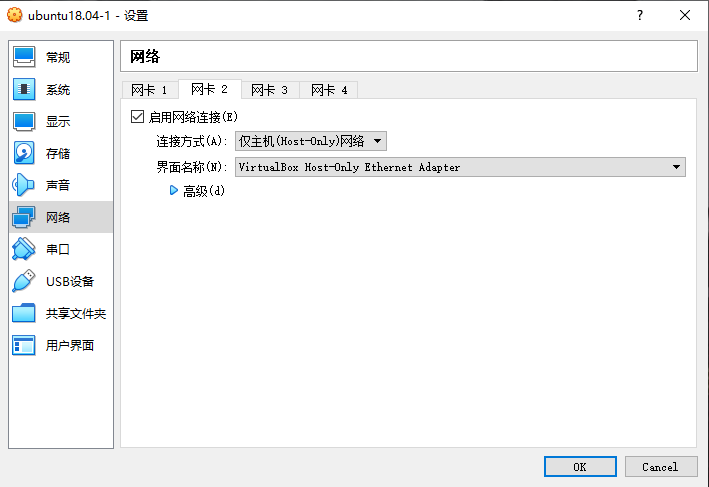

&emsp;
* 进入并登录虚拟机，输入ifconfig查看当前的网络状态，仍然只显示一块网卡
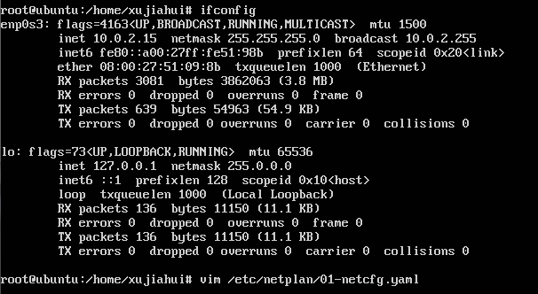

&emsp;
* 用netplan命令，进入.yaml的文件进行第二块网卡的配置，新增加最后两行，添加第二块网卡信息，强制保存退出，并执行"netplan apply"应用网络配置
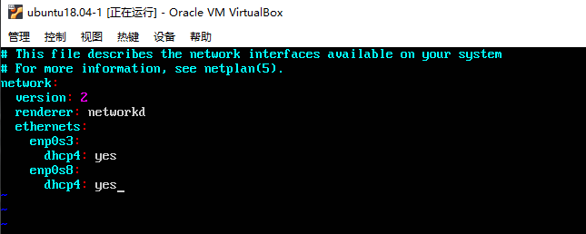

&emsp;
* 再次用ifconfig命令查看网络状态，此时已经完成了第二块网卡的成功添加，实现了开机自动启用和自动获取IP
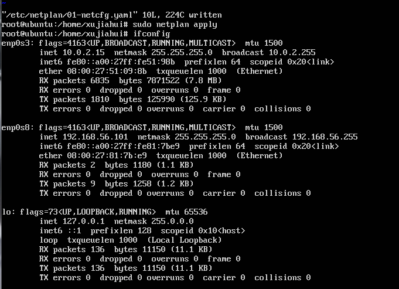

&emsp;
### 3、如何使用sftp在虚拟机和宿主机之间传输文件？

#### 本次实验采用的方法

* 本次实验借助了xftp软件(基于SFTP、FTP的文件传输软件)进行虚拟机和宿主机之间的文件传输
&emsp;

* 首先新建会话，输入主机名(虚拟机的ip地址)，选择STFP协议，将端口号改为22，输入用户名和对应密码，确定建立会话
&emsp;
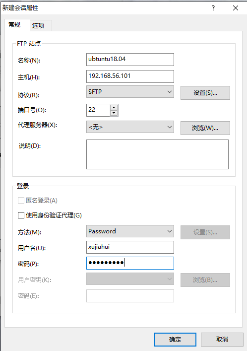
&emsp;

* 选择该会话进行连接，虚拟机和宿主机都切换至对应目录，选择文件右键选择传输即可实现虚拟机和宿主机之间的文件传输
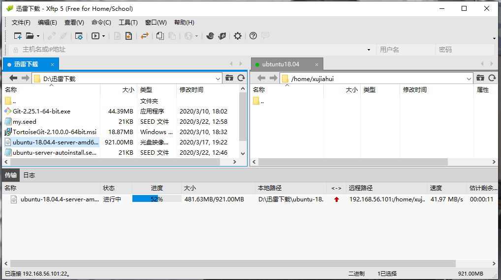
&emsp;
&emsp;
#### 其他方法

* [使用scp命令在虚拟机和宿主机之间传输文件](https://www.cnblogs.com/lijingchn/p/5532641.html)
* [使用xshell的rz和sz命令在虚拟机和宿主机之间传输文件](https://blog.csdn.net/cl11992/article/details/86150398)
&emsp;
***

## 问题与解决方案

* **问题1**：用当前用户登录，尝试传输.seed文件保存至~/cd/preseed文件夹时，无法进行操作，显示当前用户权限不够
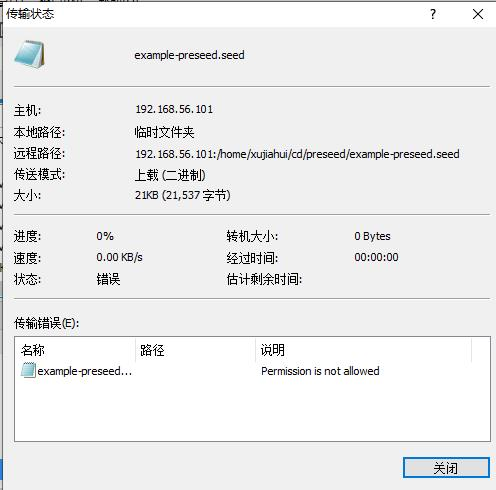

* **解决方案**：先用当前用户身份将.seed文件传输至有权限读写的文件夹，再用root身份登录，用mv语句进行文件的移动
&emsp;

&emsp;

* **问题2** ：用mkisofs语句进行定制镜像制作时，找不到该命令
* **解决方案**：根据提示安装genisoimage&emsp;

&emsp;

### 参考资源
* [Ubuntu终端切换到root用户的方法](https://www.cnblogs.com/xinjie10001/p/6295020.html)
* [Ubuntu终端进行文件移动的方法](https://blog.csdn.net/qq_38451119/article/details/81121906)
