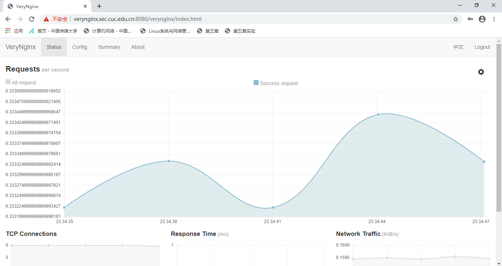

# 第五章：Web服务器（实验）

## 实验环境
* Ubuntu 18.04 Server 64bit
* nginx/1.14.0 (Ubuntu)
* VeryNginx
* wordpress-4.7
* DVWA

## 环境配置
#### 配置主机host文件
向 `C:\Windows\System32\drivers\etc\hosts` 中添加三条内容
```
    192.168.56.101 wp.sec.cuc.edu.cn
    192.168.56.101 dvwa.sec.cuc.edu.cn
    192.168.56.101 verynginx.sec.cuc.edu.cn
```

#### 安装nginx
```
    sudo apt update
    sudo apt install nginx
```
用`systemctl status nginx`，看到nginx的状态为`active(running)`，即成功开启nginx，此时访问 192.168.56.101:80 会出现Nginx的欢迎页面


#### 安装VeryNginx
根据官方的 GitHub [仓库指南](https://github.com/alexazhou/VeryNginx/blob/master/readme_zh.md)进行安装

```
    # 克隆 VeryNginx 仓库到本地
    git clone https://github.com/alexazhou/VeryNginx.git
    # 然后进入仓库目录
    cd VeryNginx
    python install.py install

    # 根据报错信息安装依赖
    sudo apt-get install python3
    sudo apt-get install libpcre3 libpcre3-dev libssl-dev build-essential
    sudo apt-get install libssl1.0-dev
    sudo apt install make
    sudo apt install gcc
    sudo apt-get install zlib1g-dev

    # 再尝试安装
    sudo python3 install.py install

    # 根据报错添加用户nginx
    sudo adduser nginx

    # 启动VeryNginx服务
    sudo /opt/verynginx/openresty/nginx/sbin/nginx
```

由于此时nginx与VeryNginx都占用80端口，导致无法正常开启服务
```
    # 显示进程信息
    ps -ef | grep nginx
    # 杀死Nginx进程以便开启VeryNginx服务
    sudo kill -9 进程号
```

为了为了能够同时开启Nginx和VeryNginx，将Nginx的端口改为8080
```
    # 修改VeryNginx配置文件
    sudo vim /opt/verynginx/openresty/nginx/conf/nginx.conf 

    #修改内容
        user www-data;
        listen 8080;
        
    # 重新启动VeryNginx服务
    sudo /opt/verynginx/openresty/nginx/sbin/nginx
```
访问 `http://verynginx.sec.cuc.edu.cn:8080/verynginx/index.html` 到 VeryNginx 的界面，用户/密码为 verynginx/verynginx




#### 安装wordpress
下载mysql、php和相关扩展
```
    # 安装数据库
    sudo apt install mysql-server
    检查是否正常运行，默认下无密码
    sudo mysql -u root -p

    #安装php和相关扩展
    sudo apt install php-fpm php-mysql
    sudo apt install php-curl php-gd php-intl php-mbstring php-soap php-xml php-xmlrpc php-zip
    sudo systemctl restart php7.2-fpm
```

创建 wordpress 需要数据库支持
```
    # mysql新建数据库
    sudo mysql -u root -p
    > CREATE DATABASE wordpress DEFAULT CHARACTER SET utf8 COLLATE utf8_unicode_ci;
    > GRANT ALL ON wordpress.* TO 'wpuser'@'localhost' IDENTIFIED BY 'test';
    > FLUSH PRIVILEGES;
    > EXIT;
```

下载 wordpress
```
    cd /tmp

    # 下载实验指定版本安装包
    sudo wget https://github.com/WordPress/WordPress/archive/4.7.zip

    # 解压
    unzip 4.7.zip

    # 移动文件夹到指定目录
    cp /tmp/WordPress-4.7/wp-config-sample.php /tmp/WordPress-4.7/wp-config.php
    sudo cp -a /tmp/WordPress-4.7/. /var/www/wordpress/html

    # 修改文件夹属主为 www-data
    sudo chown -R www-data:www-data /var/www/wordpress/html
```

修改 wordpress 数据库和nginx相关配置文件
```
    sudo vim /var/www/html/wordpress/wp-config.php
    # 修改内容如下
        #修改相关参数
        define('DB_NAME', 'wordpress');

        /** MySQL database username */
        define('DB_USER', 'wpuser');

        /** MySQL database password */
        define('DB_PASSWORD', 'test');

        # 新增相关内容
        define('FS_METHOD', 'direct');
  
    # 修改nginx相关配置
    sudo vim /etc/nginx/sites-available/default
        server {
            # 修改监听端口
            listen 8888;

            # 修改网站根站点
            root /var/www/html/wordpress;
                
            # 修改server_name
            wp.sec.cuc.edu.cn

                
            index index.html index.htm index.php index.nginx-debian.html;

            location / {
                try_files $uri $uri/ = 404;
            }

            location ~ \.php$ {
                include snippets/fastcgi-php.conf;
                fastcgi_pass unix:/var/run/php/php7.2-fpm.sock;                
                }
            }
```     

```
    # 语法检查
    sudo nginx -t
    # 重启nginx
    sudo systemctl restart nginx
```
此时可访问 `http://wp.sec.cuc.edu.cn:8888/`，用户/密码为 admin/password


#### 安装DVWA
下载安装包
```
    cd /tmp
    git clone https://github.com/ethicalhack3r/DVWA
    sudo mv /tmp/DVWA /var/www/html
```

dvwa需要数据库支持，所以先新建数据库
```
    sudo mysql -u root -p
    > CREATE DATABASE dvwa DEFAULT CHARACTER SET utf8mb4 COLLATE utf8mb4_unicode_ci;
    > GRANT ALL ON dvwa.* TO 'dvwauser'@'localhost' IDENTIFIED BY 'test';
    > FLUSH PRIVILEGES;
    > EXIT;
    sudo systemctl restart mysql
```

修改dvwa数据库和nginx相关设置
```
    cd /var/www/html/DVWA
    cp config/config.inc.php.dist config/config.inc.php
    sudo vim /var/www/html/DVWA/config/config.inc.php 

        # 修改以下内容
        $_DVWA[ 'db_database' ] = 'dvwa';
        $_DVWA[ 'db_user' ]     = 'dvwauser';
        $_DVWA[ 'db_password' ] = 'test';
  
    # 修改文件属主
    sudo chown -R www-data:www-data /var/www/html/DVWA

    # 修改 nginx 相关配置
    sudo vim /etc/nginx/sites-available/default

          server {
                listen 5566;
                root /var/www/html/DVWA;
                server_name  dvwa.sec.cuc.edu.cn;
                index index.html index.htm index.php index.nginx-debian.html;

                location / {
                    try_files $uri $uri/ = 404;
                }

                location ~ \.php$ {
                    include snippets/fastcgi-php.conf;
                    fastcgi_pass unix:/var/run/php/php7.2-fpm.sock;
                }
            }

    重启nginx，使配置生效
    sudo systemctl restart nginx
```
此时可访问 `http://dvwa.sec.cuc.edu.cn:5566/`，根据安装界面提示修改php.ini
```
    sudo vim  /etc/php/7.2/fpm/php.ini

    # 修改php.ini中下列选项
    allow_url_include = On
    # 重启使配置生效
    systemctl restart php7.2-fpm
    # 重启nginx
    sudo systemctl restart nginx
```


## 实验检查点
#### 基本要求
- 在一台主机（虚拟机）上同时配置Nginx和VeryNginx
    - VeryNginx作为本次实验的Web App的反向代理服务器和WAF
    - PHP-FPM进程的反向代理配置在nginx服务器上，VeryNginx服务器不直接配置Web站点服务
- 使用Wordpress搭建的站点对外提供访问的地址为： http://wp.sec.cuc.edu.cn
- 使用Damn Vulnerable Web Application (DVWA)搭建的站点对外提供访问的地址为： http://dvwa.sec.cuc.edu.cn

实现过程
- 修改Nginx配置文件，将原本wordpressd的 8888 端口修改为 127.0.0.1:8888，DVWA的 5566 端口修改为 127.0.0.1:5566

- 通过 VeryNginx 进行相关设置
    
    

实现效果


#### 安全加固要求
- 使用IP地址方式均无法访问上述任意站点，并向访客展示自定义的友好错误提示信息页面-1

    - 在verynginx管理界面配置以下规则
        
        
        

    - 实现效果
        
        
        

- Damn Vulnerable Web Application (DVWA)只允许白名单上的访客来源IP，其他来源的IP访问均向访客展示自定义的友好错误提示信息页面-2
    - 在verynginx管理界面配置以下规则
        
        
        
    - 实现效果
        
- 在不升级Wordpress版本的情况下，通过定制VeryNginx的访问控制策略规则，热修复WordPress < 4.7.1 - Username Enumeration

    - 在verynginx管理界面配置以下规则,禁止访问特定的URI(wp-json/wp/v2/users/)
        
        
        
    - 实现效果(前后对比)
        
        
- 通过配置VeryNginx的Filter规则实现对Damn Vulnerable Web Application (DVWA)的SQL注入实验在低安全等级条件下进行防护
sql注入：
  - 把DVWA Security调整为Low
    
  - 在verynginx管理界面配置以下规则
        
        
        
  - 实现效果(前后对比)
        
        

#### VeryNginx配置要求
- VeryNginx的Web管理页面仅允许白名单上的访客来源IP，其他来源的IP访问均向访客展示自定义的友好错误提示信息页面-3(未验证)
    - 在verynginx管理界面配置以下规则
        
        
        
    - 实现效果
        
- 通过定制VeryNginx的访问控制策略规则实现：
    - 限制DVWA站点的单IP访问速率为每秒请求数 < 50
    - 限制Wordpress站点的单IP访问速率为每秒请求数 < 20
    - 超过访问频率限制的请求直接返回自定义错误提示信息页面-4
  
    实现过程
    - 在verynginx管理界面配置以下规则        
        
        
    -  执行`sudo apt-get install `下载apache2-utils包，使用ab进行测试 
        
        
    - 实现效果
        
        
        

- 禁止curl访问
    - 在verynginx管理界面配置以下规则
        
        
        
    - 实现效果(前后对比)
        
        

## 实验遇到的问题
- 在使用 VeryNginx 配置反向代理时，wordpress 出现强行跳转到之前 wordpress 的url访问方式
    - 解决：手动修改数据库中的内容
        

- wordpress搭建的站点显示异常
    
    - 排查：
        
    - 解决：verynginx改为监听80端口

- 热修复WordPress < 4.7.1 - Username Enumeration时无法漏洞复现，访问地址 http://wp.sec.cuc.edu.cn/wp-json/wp/v2/users/ 出现404
  - 排除：已经在WordPress管理界面Settings->Permalinks中的Common Settings设置为非Plain模式，设置为Day and name
  - 解决：修改/etc/nginx/sites-available/default，改动内容如下：
    ```
    location / {
        try_files $uri $uri/ /index.php$is_args$args;
    }

    location ~ ^/wp-json/ {
        # if permalinks not enabled
        rewrite ^/wp-json/(.*?)$ /?rest_route=/$1 last;
    }
    ```

- 在虚拟机中下载包 apache2-utils后，无法使用ab进行测试
    - 解决：在虚拟机/etc/hosts文件中添加以下内容
        ```
        192.168.56.101 wp.sec.cuc.edu.cn
        192.168.56.101 dvwa.sec.cuc.edu.cn
        192.168.56.101 verynginx.sec.cuc.edu.cn
        ```

## 参考资料
[alexazhou/VeryNginx/blob](https://github.com/alexazhou/VeryNginx/blob/master/readme_zh.md)

[WordPress < 4.7.1 - Username Enumeration](https://www.exploit-db.com/exploits/41497)

[WordPress REST API 内容注入漏洞](https://www.seebug.org/vuldb/ssvid-92637)

[how-do-i-get-the-wordpress-json-api](https://stackoverflow.com/questions/30379940/how-do-i-get-the-wordpress-json-api-to-work-on-nginx-server)

[CUCCS/linux-2019-Lyc-heng](https://github.com/CUCCS/linux-2019-Lyc-heng/blob/chap0x05/chap0x05/实验报告.md)

[How To Install WordPress with LEMP on Ubuntu 18.04](https://www.digitalocean.com/community/tutorials/how-to-install-wordpress-with-lemp-on-ubuntu-18-04)

[How to Install and Configure DVWA Lab on Ubuntu 18.04 server](https://kifarunix.com/how-to-setup-damn-vulnerable-web-app-lab-on-ubuntu-18-04-server/)
