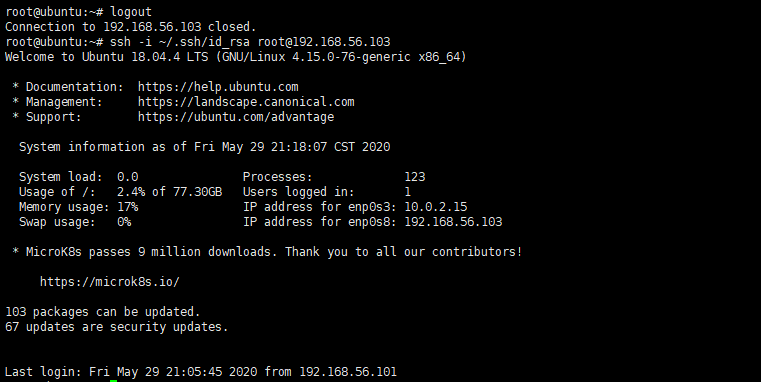

# SHELL脚本编程练习进阶（实验）

FTP、NFS、DHCP、DNS、Samba服务器的自动安装与自动配置

## 实验环境
工作主机(Ubuntu-18.04.4-Server 64bit)：192.168.90.101
目标主机(Ubuntu-18.04.4-Server 64bit)：192.168.90.103

## 实验要求
* FTP 
    * 对照第6章课件中的要求选择一款合适的FTP服务器软件支持所有任务要求
* NFS 
    * 对照第6章课件中的NFS服务器配置任务
* DHCP 
    * 2台虚拟机使用Internal网络模式连接，其中一台虚拟机上配置DHCP服务，另一台服务器作为DHCP客户端，从该DHCP服务器获取网络地址配置
* Samba 
    * 对照第6章课件中smbclient一节的3点任务要求完成Samba服务器配置和客户端配置连接测试
* DNS 
    * 基于上述Internal网络模式连接的虚拟机实验环境，在DHCP服务器上配置DNS服务，使得另一台作为DNS客户端的主机可以通过该DNS服务器进行DNS查询 在DNS服务器上添加 `zone "cuc.edu.cn" `的以下解析记录

## 实验过程
1. 配置工作主机到目标主机的远程SSH免密登录
    * 目标主机SSH配置
        ```
        #开启ssh服务
        sudo service ssh start

        #修改ssh配置文件
        sudo vim /etc/ssh/sshd_config

        #设置可通过口令认证SSH
        PasswordAuthentication yes

        #设置允许root用户登录
        PermitRootLogin yes

        #重启ssh服务
        sudo systemctl restart ssh

        #给root用户设置密码
        sudo passwd
        ```
    * 工作主机生成秘钥
        ```
        #生成一对公私钥
        ssh-keygen -t rsa -P '' -f ~/.ssh/id_rsa

        #将公钥传输至目标主机authorized_keys文件
        ssh-copy-id -i ~/.ssh/id_rsa root@192.168.56.103

        #测试连接
        ssh root@192.168.56.103
        ```
        

    * 修改目标主机配置文件,设置免密登录
        ```
        #修改ssh配置文件
        sudo vim /etc/ssh/sshd_config

        #取消root口令并禁用口令登录
        PasswordAuthentication no
        PermitRootLogin without-password

        #重启ssh服务
        sudo systemctl restart ssh
        ```
        
    * 免密登录
        ```
        ssh -i ~/.ssh/id_rsa root@192.168.56.103
        ```
        

2. FTP
    * 脚本及配置文件
        [vsftpd.sh](./script/vsftpd.sh) 
        [vsftpd.conf](./configs/vsftpd.conf)
  
        ```
        将脚本文件vsftpd.sh拷贝到目标主机
        scp -i .ssh/id_rsa workspace/shell/vsftpd.sh root@192.168.56.103:workspace/

        借助SSH的远程命令执行功能实现目标主机控制安装和配置
        ssh -i .ssh/id_rsa root@192.168.56.103 'bash workspace/vsftpd.sh'
        ```

    * 配置一个提供匿名访问的FTP服务器，匿名访问者可以访问1个目录且仅拥有该目录及其所有子目录的只读访问权限

        

    * 配置一个支持用户名和密码方式访问的账号，该账号继承匿名访问者所有权限，且拥有对另1个独立目录及其子目录完整读写（包括创建目录、修改文件、删除文件等）权限，（该账号仅可用于FTP服务访问，不能用于系统shell登录）

        

    * FTP用户不能越权访问指定目录之外的任意其他目录和文件
    无论是匿名用户还是非匿名用户都不能访问其他目录文件  
        

    * 匿名访问权限仅限白名单IP来源用户访问，禁止白名单IP以外的访问
        

3. NFS
    * 脚本及配置文件
        [nfs_srv.sh](./script/nfs_svr.sh)
        [nfs_clt.sh](./script/nfs_clt.sh)
        [/etc/exports](./configs/export.conf)
        ```        
        #将nfs_srv.sh拷贝到目标主机
        scp -i .ssh/id_rsa workspace/shell/nfs_svr.sh root@192.168.56.103:workspace/
        ```

        ```
        #工作主机运行nfs_srv.sh脚本
        ssh -i .ssh/id_rsa root@192.168.56.103 'bash workspace/nfs_svr.sh'

        #在目标主机通过进程查看nfs服务是否运行
        ps -aux|grep -v grep|grep nfs
        ```

        

        ```
        #工作主机运行nfs_clt.sh脚本
        bash nfs_clt.sh
        ```

    * 在1台Linux上配置NFS服务，另1台电脑上配置NFS客户端挂载2个权限不同的共享目录，分别对应只读访问和读写访问权限
        
    * 在NFS客户端上可以看到
        * 创建的两个共享目录分别为:只读/nfs/gen_r和读写/nfs/gen_rw 
            
        * 两个共享文件目录对应只读和读写访问权限 
            
        * 客户端共享目录中文件、子目录的属主、权限信息和在NFS服务器端的信息一致
  
            - 客户端
            

            - 服务器端
            

  
       * 资料解读NFS目录中的属主和属主组信息
            ```
            By default, NFS translates requests from a root user remotely into a non-privileged user on the server. This was intended assecurity feature to prevent a root account on the client fromusing the file system of the host as root. no_root_squashdisables this behavior for certain shares.
            ```
          * 设置了no_root_squash 访问共享目录时，用户如果是root权限，对共享目录也具有root权限,这种做法增加了服务安全隐患，但此时可以向客户端主机写入文件
          * 未设置no_root_squash 访问共享目录时，如root_squash ，如果访问共享目录是root的权限用户，对共享目录的权限会被压缩为nfsnobody用户的权，此时无法向客户端主机写入文件
4. DHCP
   * 脚本及配置文件
        [dhcp.sh](./script/dhcp.sh)
        [/etc/dhcp/dhcpd.conf](./configs/dhcpd.conf)
        [/etc/default/isc-dhcp-server](./configs/isc-dhcp-sever.conf)

    * 将两台虚拟机增加网卡,使用Internal网络模式连接
      * DHCP服务器端主机
        
      * DHCP客户端主机
          

    * server配置
        ```
        #将脚本dhcp.sh拷贝到目标主机
        scp -i .ssh/id_rsa workspace/shell/dhcp.sh root@192.168.56.103:workspace/

        #运行dhcp.sh脚本
        ssh -i .ssh/id_rsa root@192.168.56.103 'bash workspace/dhcp.sh'
        ```
        

    * client配置
        修改配置文件`/etc/netplan/01-netcfg.yaml`，添加enp0s9,设置dhcp4: yes,`sudo netplan apply`使配置生效
        

5. Samba
    * 脚本及配置文件
      * [smb_srv.sh](./script/smb_srv.sh)
      * [/etc/samba/smb.conf](./configs/)
    * 执行脚本smb_srv.sh
  
    * 在windows 10客户端上连接Linux上的Samba服务器
        * 打开资源管理器，右键“此电脑”，选择“添加一个网络位置”
            
        * 输入共享文件夹路径
            

        * 访问指定用户文件夹，需要输入账号密码，且可以创建文件夹
            
        * 访问匿名目录，不用输入账号密码，且不可以创建文件夹
            

    * 在Linux上连接Windows10上的服务器
      * sudo apt-get install smbclient
      * Linux访问Windows的匿名共享目录
        

      * Linux访问Windows的用户名密码方式共享目录
        
      * 下载整个目录

6. DNS
    * 基于上述Internal网络模式连接的虚拟机实验环境，在DHCP服务器上配置DNS服务，使得另一台作为DNS客户端的主机可以通过该DNS服务器进行DNS查询
在DNS服务器上添加 zone "cuc.edu.cn" 的以下解析记录
   * server
        * 安装Bind
            ```
            sudo apt-get install bind9 bind9utils bind9-doc
            ```
        * 修改配置文件
            ``` 
            sudo vim /etc/bind/named.conf.options

            #在options选项中添加以下配置
            listen-on { 192.168.56.102; };  # ns1 private IP address - listen on private network only
            allow-transfer { none; }; # disable zone transfers by default
            forwarders {
               8.8.8.8;
                8.8.4.4;
            };
            
            sudo vim /etc/bind/named.conf.local
            
            #添加如下配置
            zone "cuc.edu.cn" {
            type master;
            file "/etc/bind/db.cuc.edu.cn";
            };
        * 生成配置文件`db.cuc.edu.cn`
            ```
            sudo cp /etc/bind/db.local /etc/bind/db.cuc.edu.cn
            ```
        * 编辑配置文件
            ```
            sudo vim /etc/bind/db.cuc.edu.cn 
            ```
        * 重启bind9
            ```
            sudo service bind9 restart
            ```
    * client
        * 安装resolvconf
            ```
            sudo apt update 
            sudo apt install resolvconf
            ```
        * 修改配置文件
            ```
            sudo vim /etc/resolvconf/resolv.conf.d/head
            
            #添加配置
            search cuc.edu.cn
            nameserver 192.168.57.1
        
        * `sudo resolvconf -u`
    
            

## 问题及解决
   * 克隆出的虚拟机IP地址相同，均为192.168.56.101
      * 原因：systemd networkd使用与dhclient不同的方法生成DUID。默认情况下，dhclient使用链接层地址，而systemd networkd使用/etc/machine-id的内容。由于虚拟机是克隆的，因此它们具有相同的machine-id，并且DHCP服务器为两者返回相同的IP
      * 解决：修改 `/etc/netplan/01-netcfg.yaml` ，在网卡的 dhcp 配置列表里添加配置参数：`dhcp-identifier: mac`
      * [参考资料](https://c4pr1c3.github.io/LinuxSysAdmin/cloud-init.md.html#/-ip-)
  
   * 设置root免密登录时报错`root@192.168.56.103: Permission denied (publickey)`
       * 解决：生成公私钥对、免密登录时都切换到root用户身份 
   * NFS挂载出错：`mount: /bak: bad option; for several filesystems (e.g. nfs, cifs) you might need a /sbin/mount.<type> helper program`
     * 原因：缺少相应的包
     * 解决：`apt install nfs-common `、`apt install nfs-utils`
     * [参考资料](https://www.cnblogs.com/ruiy/p/12394754.html)

## 参考资料
* [how-to-set-up-vsftpd-for-a-user-s-directory-on-ubuntu](https://www.digitalocean.com/community/tutorials/how-to-set-up-vsftpd-for-a-user-s-directory-on-ubuntu-16-04)

* [how-to-set-up-an-nfs-mount-on-ubuntu-18.04](https://www.digitalocean.com/community/tutorials/how-to-set-up-an-nfs-mount-on-ubuntu-18-04)


* [NFS权限配置——no_root_squash](https://blog.51cto.com/12332766/2126316)

* [How to connect to Linux Samba shares from Windows 10](https://www.techrepublic.com/article/how-to-connect-to-linux-samba-shares-from-windows-10/)

* [How to Create Network File Shares with No Passwords in Windows 8](https://www.howtogeek.com/126214/how-to-create-network-file-shares-with-no-passwords-in-windows-8/)

* [linux-2020-cuc-Lynn](https://github.com/CUCCS/linux-2020-cuc-Lynn/blob/chap0x06/chap0x06实验报告.md)

* [Getting whole folder using Smbclient](https://indradjy.wordpress.com/2010/04/14/getting-whole-folder-using-smbclient/)

* [How To Configure BIND as a Private Network DNS Server on Ubuntu 14.04](https://www.digitalocean.com/community/tutorials/how-to-configure-bind-as-a-private-network-dns-server-on-ubuntu-14-04#prerequisites)

